# Database Overview for YatraSahayata

This document provides a comprehensive overview of the database used in the **YatraSahayata** application.

## Database Summary
**Type:** Android Room Database (SQLite wrapper)  
**Database Name:** `yatrasahayata_database` (version 6)  
**Location:** Local device storage (App-private)

---

## 🏗️ Entity Relationship Diagram (ERD)

```mermaid
erDiagram
    TRIP {
        long id PK "Auto-generated"
        string source
        string destination
        double distance "Meters"
        long duration "Seconds"
        long timestamp "Start time"
        long endTimestamp "End time"
        double avgSpeed "km/h"
        double maxSpeed "km/h"
        string transportMode "driving/walking/cycling"
        double tollCost
        int tollCount
        double fuelCost
        string routeJson "Full route data"
    }

    SAVED_PLACE {
        int id PK "Auto-generated"
        string placeName
        string address
        double latitude
        double longitude
        string category "HOME/WORK/FAVORITE/CUSTOM"
        string notes
        long savedTimestamp
    }

    SAVED_ROUTE {
        int id PK "Auto-generated"
        string routeName
        string sourceAddress
        string destinationAddress
        double sourceLat
        double sourceLng
        double destLat
        double destLng
        double distanceKm
        int durationMinutes
        long savedTimestamp
    }

    FUEL_STATION {
        int id PK "Auto-generated"
        string stationId
        string name
        string brand
        string address
        double latitude
        double longitude
        double petrolPrice
        double dieselPrice
        double cngPrice
        string city
        string state
        long lastUpdated
        boolean isOpen24Hours
    }

    CACHED_SEARCH {
        int id PK "Auto-generated"
        string query
        string category
        double latitude
        double longitude
        string resultsJson "Serialized POI results"
        long timestamp
        long expiresAt
    }

    CACHED_ROUTE {
        int id PK "Auto-generated"
        string source
        string destination
        double sourceLat
        double sourceLng
        double destLat
        double destLng
        string routeJson
        string geometry
        double distanceMeters
        long durationSeconds
        long timestamp
        long expiresAt
    }
```

---

## 🗂️ Detailed Schema

### 1. Trips Table (`trips`)
Stores the history of completed trips and their statistics.

| Column | Type | Description |
| :--- | :--- | :--- |
| `id` | `long` | **Primary Key** (Auto-generated) |
| `source` | `String` | Starting location address/name |
| `destination` | `String` | Destination address/name |
| `distance` | `double` | Total distance in meters |
| `duration` | `long` | Total duration in seconds |
| `timestamp` | `long` | Trip start time (epoch millis) |
| `endTimestamp` | `long` | Trip end time (epoch millis) |
| `avgSpeed` | `double` | Average speed in km/h |
| `maxSpeed` | `double` | Maximum speed in km/h |
| `transportMode` | `String` | Mode of transport (driving, cycling, walking) |
| `tollCost` | `double` | Total toll cost for the trip |
| `tollCount` | `int` | Number of toll plazas crossed |
| `fuelCost` | `double` | Calculated fuel cost based on vehicle settings |
| `routeJson` | `String` | Full route data (JSON) for replay/details |

### 2. Saved Places Table (`saved_places`)
Stores user-bookmarked locations like Home, Work, or Favorites.

| Column | Type | Description |
| :--- | :--- | :--- |
| `id` | `int` | **Primary Key** (Auto-generated) |
| `placeName` | `String` | User-defined name (e.g., "My Office") |
| `address` | `String` | Full address of the place |
| `latitude` | `double` | Geographic latitude |
| `longitude` | `double` | Geographic longitude |
| `category` | `String` | Category: `HOME`, `WORK`, `FAVORITE`, `CUSTOM` |
| `notes` | `String` | Optional user notes |
| `savedTimestamp`| `long` | When the place was saved |

### 3. Saved Routes Table (`saved_routes`)
Stores frequently used routes to quickly start navigation without re-entering details.

| Column | Type | Description |
| :--- | :--- | :--- |
| `id` | `int` | **Primary Key** (Auto-generated) |
| `routeName` | `String` | User-defined name for the route |
| `sourceAddress` | `String` | Starting point address |
| `destinationAddress`| `String` | Destination address |
| `sourceLat` | `double` | Source latitude |
| `sourceLng` | `double` | Source longitude |
| `destLat` | `double` | Destination latitude |
| `destLng` | `double` | Destination longitude |
| `distanceKm` | `double` | Distance in kilometers |
| `durationMinutes`| `int` | Estimated duration in minutes |
| `savedTimestamp`| `long` | When the route was saved |

### 4. Fuel Stations Table (`fuel_stations`)
Stores local cache of fuel station data including prices.

| Column | Type | Description |
| :--- | :--- | :--- |
| `id` | `int` | **Primary Key** (Auto-generated) |
| `stationId` | `String` | Unique identifier from API |
| `name` | `String` | Station name |
| `brand` | `String` | Brand (IOCL, HP, BPCL, etc.) |
| `address` | `String` | Station address |
| `latitude` | `double` | Geographic latitude |
| `longitude` | `double` | Geographic longitude |
| `petrolPrice` | `double` | Current petrol price |
| `dieselPrice` | `double` | Current diesel price |
| `cngPrice` | `double` | Current CNG price (-1 if unavailable) |
| `city` | `String` | City name |
| `state` | `String` | State name |
| `lastUpdated` | `long` | Timestamp of last price update |
| `isOpen24Hours` | `boolean` | Status flag |

### 5. Cached Searches Table (`cached_searches`)
Caches search results to reduce API calls and improve performance for repeat queries.

| Column | Type | Description |
| :--- | :--- | :--- |
| `id` | `int` | **Primary Key** (Auto-generated) |
| `query` | `String` | Search query string |
| `category` | `String` | Search category filter |
| `latitude` | `double` | Search center latitude |
| `longitude` | `double` | Search center longitude |
| `resultsJson` | `String` | Serialized list of POI results (JSON) |
| `timestamp` | `long` | When the search was performed |
| `expiresAt` | `long` | When the cache entry expires |

### 6. Cached Routes Table (`cached_routes`)
Stores calculated routes for offline access or quick retrieval.

| Column | Type | Description |
| :--- | :--- | :--- |
| `id` | `int` | **Primary Key** (Auto-generated) |
| `source` | `String` | Source name |
| `destination` | `String` | Destination name |
| `sourceLat` | `double` | Source latitude |
| `sourceLng` | `double` | Source longitude |
| `destLat` | `double` | Destination latitude |
| `destLng` | `double` | Destination longitude |
| `routeJson` | `String` | Full route response (JSON) |
| `geometry` | `String` | Encoded polyline geometry |
| `distanceMeters`| `double` | Route distance |
| `durationSeconds`| `long` | Route duration |
| `timestamp` | `long` | When the route was cached |
| `expiresAt` | `long` | When the cache entry expires |
